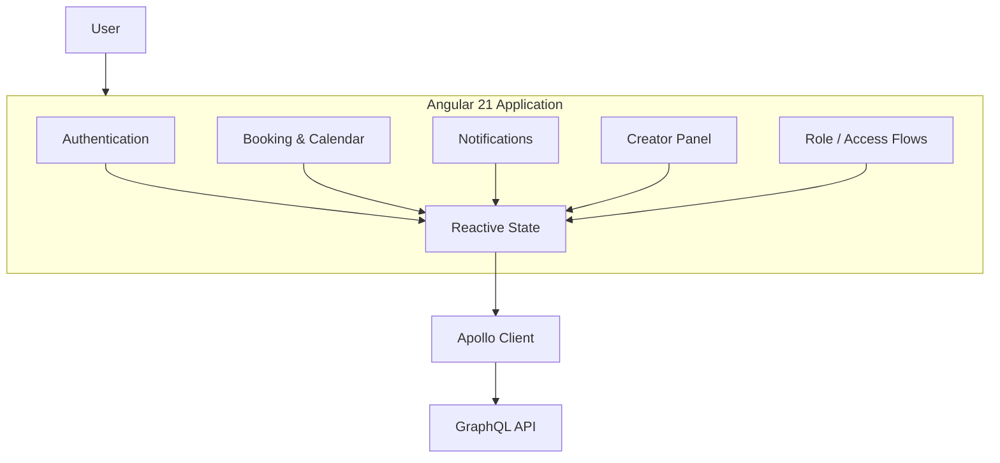
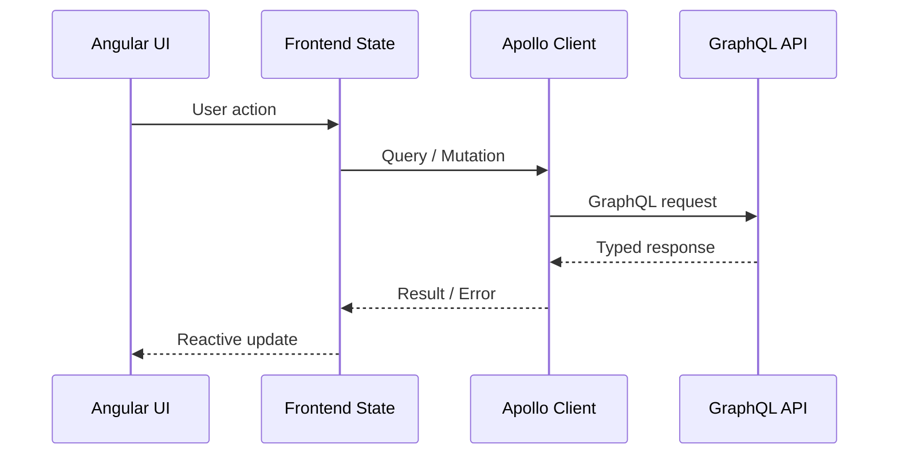

# Slowork — Frontend Platform & Web Ecosystem

> Frontend engineering case study of a startup product combining an Angular application, GraphQL integrations, OAuth 2.0, booking flows, public Astro sites and technical SEO.

> **Some production repositories and backend components are private.**  
> This case study documents my frontend work, engineering decisions and product contributions without exposing confidential source code or internal business data.

---

## Overview

Slowork is a startup product developed by a multidisciplinary team spanning engineering, marketing, legal, strategy and social media.

I participate as **Co-Founder and Angular Frontend Engineer**.

My work has covered both the core application frontend and the public web ecosystem, including:

- Angular application development
- reactive frontend architecture
- GraphQL / Apollo integration
- OAuth 2.0 authentication
- booking and calendar flows
- notifications
- Creator Panel
- access control
- landing pages
- Astro migration
- blog architecture
- technical SEO
- Core Web Vitals
- frontend/backend coordination
- product feedback and technical prioritization

The current engineering team is small, which makes clear ownership and coordination especially important.

Project involvement: **January 2024 — Present**

---

## Product Scope

Slowork combines a private product application with a public acquisition and content ecosystem.

### Core Application

- authentication
- user access flows
- booking/calendar functionality
- notifications
- Creator Panel
- GraphQL-connected frontend
- role-aware interfaces

### Public Web Ecosystem

- landing pages
- content architecture
- blog
- SEO-oriented public pages
- Astro-based delivery
- performance optimization

### Product Collaboration

- frontend/backend coordination
- bug resolution
- product iteration
- technical prioritization
- SEO decisions
- collaboration with non-engineering teams

---

## Frontend Architecture

The core application is developed with **Angular 21**.

Main frontend concerns include:

- TypeScript
- RxJS
- Signals
- reactive state
- feature boundaries
- authentication state
- GraphQL data flows
- access control
- maintainability
- UI consistency

A simplified frontend view:

---

## Reactive State

The frontend uses Angular reactive primitives together with RxJS.

The objective is to keep state changes explicit and avoid unnecessary coupling between:

- UI
- authentication
- remote data
- feature logic
- navigation state

The application has evolved toward a more declarative frontend model where state is treated as a first-class architectural concern.

---

## GraphQL & Apollo

The frontend integrates with backend services through **GraphQL** using **Apollo Client**.

Typical data flow:

This layer has required real debugging work around:

- queries and mutations
- authentication headers
- inconsistent API behaviour
- state synchronization
- error handling
- frontend/backend contract changes

---

## Authentication

Authentication has been one of the more complex frontend areas.

The application includes **OAuth 2.0** flows and role-aware access behaviour.

The frontend is responsible for:

- initiating authentication
- handling callback state
- maintaining session-aware UI
- restricting navigation where appropriate
- coordinating authenticated API access

The backend remains the security authority.

Frontend access restrictions exist to improve UX and navigation consistency, not to replace backend authorization.

---

## Booking & Calendar Flows

The product includes reservation/calendar functionality.

Frontend responsibilities include:

- displaying availability and booking state
- submitting user actions
- synchronizing UI with remote data
- handling asynchronous states
- reflecting errors and confirmations
- keeping calendar and product state consistent

These flows are especially sensitive to stale data and synchronization problems, making reactive state and clear API contracts important.

---

## Notifications

The application includes notification functionality connected to product events.

The frontend handles:

- notification presentation
- unread/read state
- reactive updates
- user feedback
- integration with backend-driven notification data

---

## Creator Panel

A dedicated **Creator Panel** supports the content-creator side of the MVP.

The panel represents one of the real user-facing areas currently available in the product.

Frontend concerns include:

- authenticated access
- creator-specific UI
- remote data
- product workflows
- state synchronization

---

## Public Web Evolution

The public-facing ecosystem evolved significantly during the project.

### Initial Stage

The first landing experience was built with **React**.

This helped move quickly during an early product stage.

### Migration to Astro

The public web layer was later moved toward **Astro** to better support:

- fast delivery
- content-oriented pages
- SEO
- reduced client-side JavaScript
- maintainable landing-page development

This reflects an important product-engineering principle:

> The best framework depends on the problem being solved, not on maintaining one stack everywhere.

---

## Blog & Content Architecture

I worked on modernizing the blog and connecting public content with backend/API data.

Areas included:

- blog structure
- content presentation
- API-connected content
- technical SEO
- page performance
- content discoverability

The objective was to make the public ecosystem more useful for both users and search engines.

---

## Technical SEO

Technical SEO has been one of my main responsibilities within the Slowork web ecosystem.

Work has included:

- metadata
- indexability
- public-site structure
- Core Web Vitals
- landing-page performance
- content architecture
- crawlability
- SEO-oriented technical decisions

Selected landing pages were optimized to achieve **100/100 Lighthouse scores**.

This is treated as a measured result on specific pages, not as a claim that every product screen permanently scores 100/100.

---

## Performance

The public web layer is optimized around:

- reduced JavaScript
- fast rendering
- image optimization
- page weight
- Core Web Vitals
- efficient content delivery

Astro is used where a content-first architecture provides a better fit than a full client-side application.

---

## Team Workflow

Development work is coordinated through **ClickUp** using a **Kanban-style workflow**.

The engineering process includes:

- prioritized tasks
- issue tracking
- frontend/backend coordination
- repository separation by product area
- iterative delivery
- product feedback

The wider startup team includes people from several disciplines, while the active development team is much smaller.

That environment requires balancing technical decisions with product priorities and available engineering capacity.

---

## Selected Engineering Challenges

### 1. OAuth 2.0 Frontend Integration

**Problem**

Authentication required coordinating browser redirects, callback state, session handling and API authentication without producing inconsistent frontend state.

**Engineering focus**

- callback handling
- authenticated routing
- API integration
- error states
- access flows

**Lesson**

Authentication is not a UI feature in isolation; it affects routing, data access and application state across the product.

---

### 2. GraphQL Integration & API Bugs

**Problem**

The frontend had to operate against an evolving GraphQL API, including inconsistencies and bugs in earlier backend versions.

**Engineering response**

- isolate failing queries/mutations
- inspect GraphQL responses
- adapt frontend state handling
- coordinate fixes with backend development
- prevent API problems from creating opaque UI failures

---

### 3. Public Web Stack Evolution

**Problem**

The initial public web implementation was useful for early delivery but the product needed better performance, SEO and content-oriented development.

**Engineering response**

The public ecosystem evolved toward **Astro**, allowing the web layer to specialize around static/content-heavy delivery while Angular remained appropriate for the application product.

---

### 4. SEO as an Engineering Responsibility

**Problem**

Marketing content alone does not guarantee search visibility if the technical delivery layer is weak.

**Engineering response**

SEO was incorporated into frontend decisions involving:

- rendering
- metadata
- content architecture
- performance
- page structure
- Core Web Vitals

---

## Engineering Principles

### Frontend as Product

The frontend is not treated as a thin presentation layer.

It owns interaction design, state transitions, perceived performance and a major part of product reliability.

### API Contracts Matter

GraphQL reduces some integration friction, but frontend correctness still depends on stable contracts and predictable backend behaviour.

### Use the Right Rendering Model

Angular is used for application complexity.

Astro is used where content delivery, SEO and low client-side overhead are the priority.

### Measure Performance

Performance work is evaluated using tools such as Lighthouse and Core Web Vitals rather than visual perception alone.

### Product Context Matters

Technical architecture must adapt to changing product priorities and startup constraints.

---

## My Role

**Angular Frontend Engineer & Co-Founder**

My responsibilities include:

- Angular frontend development
- reactive state
- GraphQL / Apollo integration
- OAuth 2.0 frontend flows
- booking and calendar UI
- notifications
- Creator Panel
- Astro public sites
- landing pages
- blog evolution
- technical SEO
- performance optimization
- frontend/backend collaboration
- product feedback

I currently own a significant part of the frontend work while collaborating with the backend/API developer.

---

## Project Status

**Product evolution / MVP stage**

The product has real MVP users in the content-creator workflow.

Development priorities continue to evolve alongside the business model and product strategy.

This case study focuses on the engineering work completed and the technical evolution of the product rather than presenting unverified growth or commercial metrics.

---

## Tech Stack

### Frontend

`Angular 21` · `TypeScript` · `RxJS` · `Signals` · `NgRx`

### Data

`GraphQL` · `Apollo Client`

### Public Web

`Astro` · `React` · `Tailwind CSS`

### Authentication

`OAuth 2.0` · `MFA` · `Role-based access`

### Web Engineering

`Technical SEO` · `Core Web Vitals` · `Lighthouse`

### Workflow

`GitHub` · `ClickUp` · `Kanban`

---

## Repository Scope

This repository intentionally contains **documentation only**.

It does **not** contain:

- private product source code
- credentials
- OAuth secrets
- internal API credentials
- user data
- private business documentation
- internal roadmap data
- unpublished backend implementation
- production configuration

The objective is to document engineering reasoning and frontend product work while respecting company confidentiality.

---

## Author

**Alejandro González López**  
Angular Frontend Engineer & Co-Founder

- Portfolio: https://alejandrogl.is-a.dev/
- LinkedIn: https://www.linkedin.com/in/alex-gonzalez-lopez/
- GitHub: https://github.com/Frozmiz
